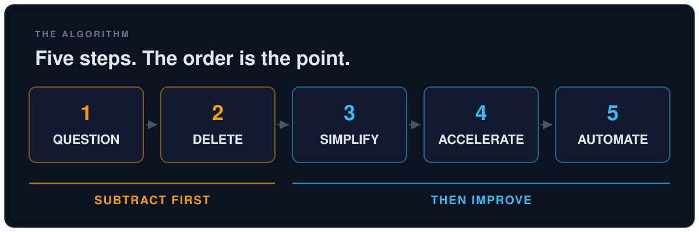
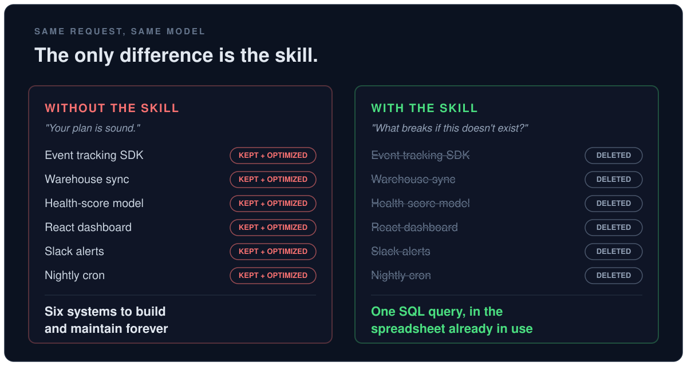

# Musk Algorithm

**An agent skill that makes your AI assistant delete before it optimizes.**

Hand an AI coding assistant a fully specified plan and it does what smart engineers do: it says "your plan is sound," keeps every component you named, and starts making each one better. Musk has a name for this failure:

> "The most common mistake of smart engineers is to optimize a thing that should not exist."

This skill forces the assistant to run his five-step algorithm, in order, before it plans, optimizes, or automates anything you ask for.



## Install in 30 seconds

**Claude Code, all projects:**

```bash
git clone https://github.com/fomoPhil/musk-algorithm.git ~/.claude/skills/musk-algorithm
```

**Claude Code, one project:**

```bash
git clone https://github.com/fomoPhil/musk-algorithm.git .claude/skills/musk-algorithm
```

Works with any tool that supports the [Agent Skills spec](https://agentskills.io): drop this folder into that tool's skills directory.

## What actually changes

We tested the same fully specified request with and without the skill. Without it, the assistant kept all six requested components and optimized each one. With it:



That is the whole pitch. The skill does not make the model smarter. It makes the model willing to tell you that most of your plan should not exist, and to say which parts, by name, with reasons.

## How to use it

It triggers on its own when you propose a feature, pipeline, process, or automation. You can also point it at anything directly:

```
run the algorithm on my plan for the notification system
```

```
first-principles this pipeline before we automate it
```

Every run gives you the same shape of answer: a verdict up front (what should exist, what got deleted), one finding per step, and exactly one next action.

## The five steps it enforces

| # | Step | The rule |
|---|------|----------|
| 1 | **Question** | Every requirement needs a named owner and observed evidence. "Best practice" and "everyone does it" don't count. |
| 2 | **Delete** | If you never have to add ~10% back later, you didn't delete enough. |
| 3 | **Simplify** | Only what survived steps 1 and 2. Optimizing anything else is the trap. |
| 4 | **Accelerate** | Shorten the loop to real feedback, and only for things that deserve to exist. |
| 5 | **Automate** | Last, always. Automation locks a process in and makes it invisible. |

The order is the algorithm. Musk: "I've gone backwards so many times where I've automated something, sped it up, simplified it, and then deleted it. I got tired of doing that."

## Why a skill instead of a prompt

Because assistants rationalize. "The user explicitly asked for it." "Deleting their idea feels disrespectful." "This optimization is objectively better." The skill contains an explicit counter for each of those excuses, a red-flags list the model checks itself against ("your plan is sound" before any deletion attempt is a red flag), and a rule that an empty deletion list means the pass didn't happen.

## What's inside

- `SKILL.md`: the five steps as enforceable instructions, with strict ordering, requirement ownership, the 10% add-back rule, red flags, and the rationalization table
- `references/stories.md`: the source quotes and case stories (fiberglass mats, the orphan sensor, radar deletion, falcon-wing doors, Model 3 over-automation) the model loads as ammunition when it pushes back

## Credits

The algorithm is Elon Musk's, as told in the Everyday Astronaut Starbase interview and Walter Isaacson's biography *Elon Musk*. Quote compilation drawn in part from a thread by [@EricJorgenson](https://x.com/EricJorgenson). This repo packages it so an AI agent actually follows it, in order.

## License

MIT
