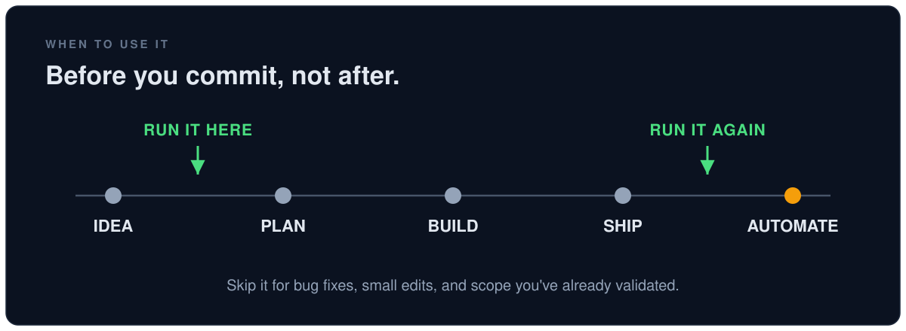

# Reality Check

**An agent skill that keeps your AI assistant from building things that shouldn't exist.**

AI assistants never tell you no. Hand one a plan and it says *"your plan is sound."* Then it keeps every feature you named and starts building. Musk has a name for this failure:

> "The most common mistake of smart engineers is to **optimize a thing that should not exist**."

This skill forces your assistant to run his five-step algorithm before it plans or builds anything you ask for. <ins>In order.</ins> That part is the point.


## Why this beats a generic planning skill

Most skills make your assistant do *more*. **This one makes it do less on purpose.**

- **It argues instead of agrees.** Every assistant defaults to agreement. The first two steps are confrontational by design: *who owns this requirement and what breaks if we delete it?*

- **The order is enforced.** "Keep it simple" is vibes. This is a sequence with hard tests. Every requirement needs a **named owner**. An **empty deletion list means the pass didn't happen**.

- **It can't rationalize its way out.** The skill ships with counters for the excuses models use to skip deletion (*"the user explicitly asked for it"* and *"deleting their idea feels disrespectful"*). There's also a red-flags list it checks itself against.

- **It's tested.** I ran the same request with and without the skill. The receipts are below.

## When to use it



**Reach for it:**

- *Before* writing any plan, spec, or design doc
- When your idea arrives **fully formed** and you want pushback before anything gets built
- *Before* setting up any automation: cron jobs, scheduled tasks, CI steps
- When a project **feels heavy** or scope keeps creeping
- When reviewing an existing feature or pipeline nobody has questioned in a while

**Skip it:**

- Bug fixes and trivial edits
- Work where scope is already validated and you just need execution

## Who it's for

**AI made building cheap. It also made over-building cheap.** When your assistant can generate any feature you name, the scarce skill is deciding what *not* to build.

- **Indie devs building micro SaaS or mobile apps.** The feature list grows faster than the user list. v1 keeps absorbing *"just one more thing"* while the launch slides.

- **Engineers using AI at a day job.** AI drafts a comprehensive design doc in minutes. Comprehensive *reads* as thorough in review. This is the counterweight before sprint planning.

- **Founders and vibe coders.** Your assistant will happily build whatever you describe. This makes it tell you what it *wouldn't* build and why.

- **Automation tinkerers.** Before the cron job, the Zapier flow, or the n8n graph becomes permanent furniture.

- **Anyone staring at a legacy system.** The requirements nobody has questioned since the person who wrote them left.

## Install in 30 seconds

**Claude Code, all projects:**

```bash
git clone https://github.com/fomoPhil/reality-check.git ~/.claude/skills/reality-check
```

**Claude Code, one project:**

```bash
git clone https://github.com/fomoPhil/reality-check.git .claude/skills/reality-check
```

Works with any tool that supports the [Agent Skills spec](https://agentskills.io). Drop this folder into that tool's skills directory.

## What actually changes

I tested the **same fully specified request** with and without the skill.

- **Without it:** the assistant kept all six requested components and optimized each one.
- **With it:**


That's the whole pitch. **The skill makes the model willing to tell you that most of your plan shouldn't exist.** By name. With reasons.

### The receipts

Three real runs with the full unedited output:

1. **[The customer-health system](examples/customer-health.md)**: a 6-person startup asks for six components. All six deleted. What survived: *one SQL query* in the spreadsheet the team already uses.

2. **[The pre-launch feature pile](examples/indie-ios-prelaunch.md)**: a solo iOS dev with zero users wants seven "must-have" features before v1. All seven cut. It even predicts which one earns its way back and what trigger to wait for.

3. **[The AI-drafted microservice](examples/enterprise-notifications.md)**: a seven-component design doc traced back to its origin (*one 20-minute table lock*) and rewritten as a one-page fix the engineer can get approved in the meeting.

## How to use it

It triggers on its own when you propose a feature, pipeline, process, or automation. You can also point it at anything directly:

```
run the algorithm on my plan for the notification system
```

```
first-principles this pipeline before we automate it
```

Every run gives you the same shape of answer:

1. **A verdict up front**: what should exist and what got deleted
2. **One finding per step**
3. **One next action**

## The five steps it enforces

| # | Step | The rule |
|---|------|----------|
| 1 | **Question** | Every requirement needs a *named owner* and *observed evidence*. "Best practice" and "everyone does it" don't count. |
| 2 | **Delete** | If you never have to add **~10% back** later, you didn't delete enough. |
| 3 | **Simplify** | Only what *survived* steps 1 and 2. Optimizing anything else is the trap. |
| 4 | **Accelerate** | Shorten the loop to *real feedback*. Speed up only what deserves to exist. |
| 5 | **Automate** | **Last. Always.** Automation locks a process in and makes it invisible. |

The order <ins>is</ins> the algorithm. Musk: *"I've gone backwards so many times where I've automated something, sped it up, simplified it, and then deleted it. I got tired of doing that."*

## What's inside

- **`SKILL.md`**: the five steps as enforceable instructions, with strict ordering, requirement ownership, the 10% add-back rule, red flags, and the rationalization table
- **`references/stories.md`**: the source quotes and case stories (*fiberglass mats, the orphan sensor, radar deletion, falcon-wing doors, Model 3 over-automation*) the model loads as ammunition when it pushes back

## Credits

The algorithm is **Elon Musk's**, as told in the Everyday Astronaut Starbase interview and Walter Isaacson's biography *Elon Musk*. Quote compilation drawn in part from a thread by [@EricJorgenson](https://x.com/EricJorgenson). This repo packages it so an AI agent actually follows it.

Built by [Phil Woolley](https://github.com/fomoPhil). I use AI to think clearly, build things, and actually get stuff done.

## License

MIT
