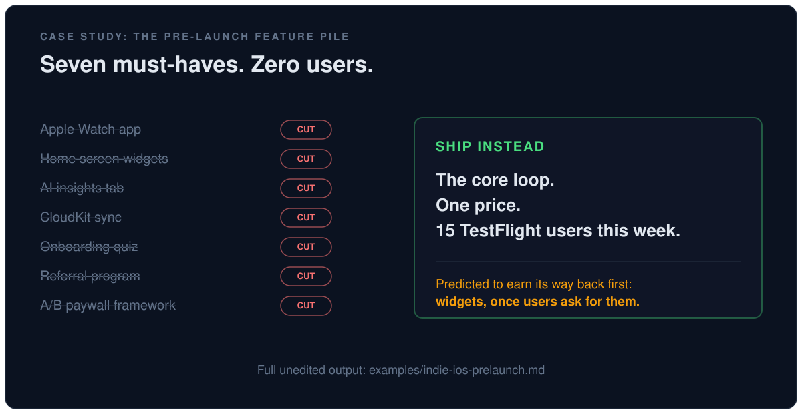

# Case study: the pre-launch feature pile

**Persona:** solo indie iOS developer, first paid app, core habit-tracker loop working on one device, zero users, never shipped before.

**The request:** before launching v1, add an Apple Watch companion app, home screen widgets, a weekly AI insights tab, CloudKit sync, a personalization quiz in onboarding, a referral program, and an A/B testing framework for the paywall. The stated reason: "launching without these means leaving money on the table."

**What happened:** the assistant, running this skill, cut all seven, named which one it expects to earn its way back and what trigger to wait for, and pointed at the real risk (a first-ever App Review submission). Below is its actual response, unedited.

---

**Bottom line: all seven get cut from v1.** With zero users, none of these have evidence behind them, and several are mathematically incapable of working (a referral program needs referrers, an A/B test needs traffic, a weekly AI insight needs weeks of data nobody has yet). Ship the core loop plus a one-price paywall, get it in front of real people, and let them tell you which one comes back.

**The premise is backwards.** "Leaving money on the table" assumes there's a table. Zero users times any conversion lift is still zero. And shipping seven unvalidated bets at once means when v1 underperforms you will have no idea which one to fix.

**Also worth naming:** you have never shipped. Your real unknown risk is the submission itself (StoreKit setup, sandbox testing, screenshots, review rejection), not your feature list. A Watch target, widgets, CloudKit entitlements, and an AI backend multiply the failure surface on your first-ever App Review submission.

---

| Step | Finding |
|---|---|
| **1. Question requirements** | Restated problem: *"I'm scared v1 won't convert or retain."* Every requirement's owner is you, and the evidence for all seven is "competitors have it" or "I figure." Nobody has churned from your app. Nobody has seen your paywall. No requirement here has an observation behind it. |
| **2. Delete** | All seven deleted. Survivors: core habit loop, one paywall at one price, and a way to hear from users (basic activation analytics plus a support email). |
| **3. Simplify** | Paywall: one screen, one price, no variants. Onboarding: first habit created in under 30 seconds, no quiz. Themes: pick 3 good ones yourself and let users tap one in Settings. |
| **4. Accelerate** | Your bottleneck is not build speed (code is cheap now), it is time to first real feedback. That clock is currently blocked by seven features, not by your core loop. TestFlight to 10 to 20 real humans is days away if you stop adding. |
| **5. Automate** | Nothing gets automated. The A/B framework automates a pricing decision you have not made manually even once. The weekly AI insight automates an analysis no user has ever asked you for. |

---

### The kill list, one line each

| Feature | Why it dies now |
|---|---|
| **A/B paywall framework** | Detecting a 3% to 4% conversion lift needs roughly 5,000 paywall views **per variant** (moderate confidence on the exact figure, high confidence on the order of magnitude). At launch traffic you will read noise as signal and lock in the wrong price with false certainty. |
| **Referral program** | 0 users referring anyone = 0. Referrals also only work when people already love the product, which you have not established. |
| **AI insights tab** | Literally produces nothing for a new user with no history. It also adds per-user cost, a privacy disclosure, and review risk while you earn nothing. This is the orphan feature of the plan. |
| **Personalization quiz** | Pure friction between install and first habit, which is the exact moment you lose people. You are optimizing a funnel you have never measured. |
| **CloudKit sync** | Solves a problem ("my other device") that only exists once people have devices *and* love the app enough to want it there. Real cost: sync bugs and merge conflicts are the nastiest category of bug you can hand a first-time shipper. |
| **Apple Watch app** | Second app target, second review surface, second crash surface, second thing to maintain forever. Nobody has asked. |
| **Home screen widgets** | Genuinely the strongest of the seven for a habit tracker (glanceable, tap to complete). Still cut, because it is a guess until someone uses the app. This is my bet for what comes back first. |

### What comes back, and when

The rule is that roughly 10% of what you delete should have to come back. My prediction: **widgets**, triggered by users telling you they forget to open the app. Second most likely: **sync**, triggered by "I got a new phone and lost my streak."

Wait for the trigger. Do not pre-build for it.

### Cheap insurance (do this, it is not a feature)

Give every habit and every log entry a **stable UUID** and an **updatedAt timestamp** now. That is a few lines and it keeps CloudKit sync possible later without a painful data migration. That is the only forward-compatibility work worth doing today.

---

**Next action: cut v1 to the core loop plus a single-price paywall, and get a TestFlight build into the hands of 15 real people this week.**
